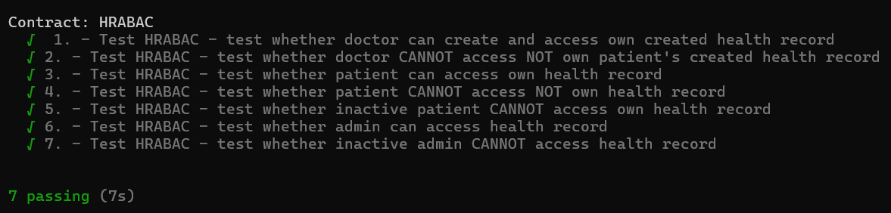

"# smart-contracts-hrabac"

Implementation and usage of Hybrid Role and Attribute Based Access Control in blockchain smart contracts

There are three roles: Admin, Doctor and Patient. Admin should see all the Electronic Health Records (EHR) in the hospital, Doctor should create new EHR and see only these, that he/she has created. Pateint should see only his/her own EHR.

In order to run the tests, please type in root folder of the project in the command prompt:

truffle test

The result is as follows:

